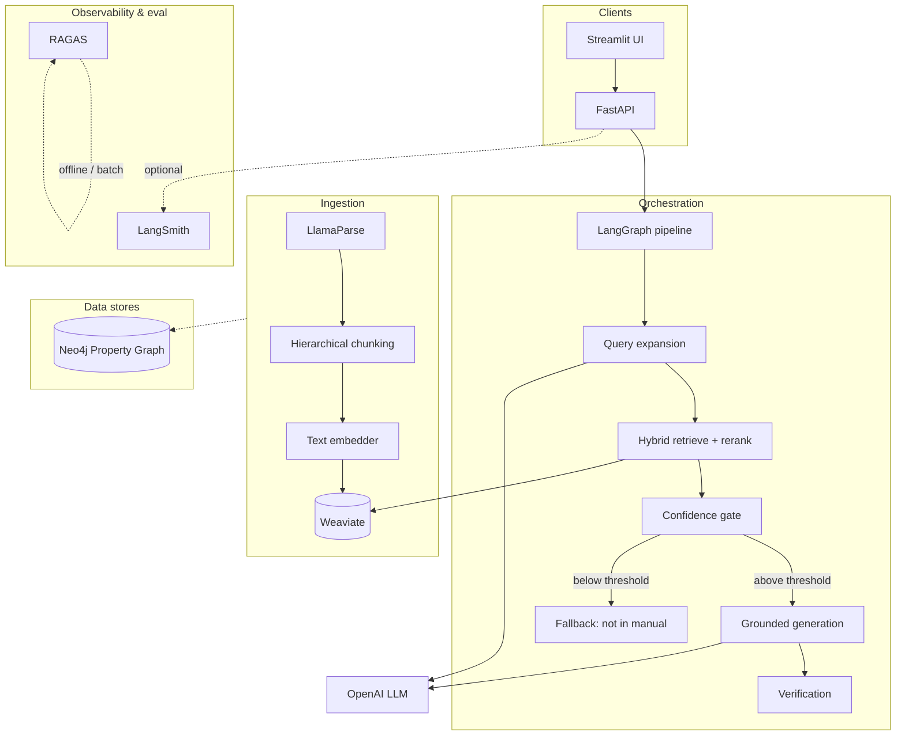

# Advanced RAG — System Design

This document describes the **multimodal RAG system** built for technical documentation: what was implemented, which alternatives were considered, **why specific choices were made**, and the **trade-offs** that follow. It is written as a system design record rather than a quick-start-only README.

---

## 1. Purpose and scope

**Goal:** ingest complex technical manuals (PDFs, scans, tables, figures), index them with **hierarchical** and **hybrid** retrieval, orchestrate **multi-step** query handling with **grounding and verification**, and expose the stack through a **FastAPI** service and **Streamlit** UI.

**In scope (implemented or scaffolded):**

- Parsing and chunking pipeline (LlamaParse + hierarchical nodes).
- Text embeddings with **multiple providers** (Voyage, BGE-M3, OpenAI) selectable at runtime via configuration.
- Vector storage on **Weaviate**; graph storage on **Neo4j** (client and store wiring).
- Hybrid retrieval (dense + BM25) with **reranking** (BGE-reranker or Cohere).
- **LangGraph** orchestration: query expansion → retrieve → confidence gate → grounded answer → verification.
- **ColPali**-based vision embedding helper (late-interaction for page/diagram semantics).
- Evaluation hooks (**RAGAS**) and observability hooks (**LangSmith**).
- **Docker Compose** for Weaviate + Neo4j; **`.env.example`** for all secrets and knobs.

**Out of scope / partial (by design for v0):**

- Full **vision retrieval path** in the LangGraph (ColPali is available; ingest does not yet push page images into a separate multimodal index by default).
- **Graph-augmented retrieval** inside the LangGraph (Neo4j PropertyGraph store is wired; multi-hop Cypher or LlamaIndex graph query nodes are not yet part of `pipeline.py`).
- Production hardening (auth on API, TLS, multi-tenant isolation, backup/restore runbooks).

---

## 2. High-level architecture

**Separation of concerns:**

| Layer | Technology | Role |
|-------|------------|------|
| UI | Streamlit | Upload, ask questions, display citations and verifier output. |
| API | FastAPI | `/ingest`, `/query`, health; decouples UI from Python graph. |
| Orchestration | LangGraph + LangChain | Stateful steps, branching, future routing (e.g. “needs diagram?”). |
| Ingestion / indexing | LlamaIndex + LlamaParse | Parse → hierarchical nodes → embeddings → Weaviate. |
| Retrieval | LlamaIndex + Weaviate + BM25 | Dense + lexical fusion; rerank before generation. |
| Graph | Neo4j (LlamaIndex graph store) | Relationship storage for future multi-hop / system-level queries. |
| Vision | ColPali + PyTorch | Late-interaction page embeddings (scaffold for multimodal retrieval). |
| Eval / traces | RAGAS, LangSmith | Offline metrics; optional online tracing. |

---

## 3. What was built (inventory)

| Artifact | Description |
|----------|-------------|
| `src/advanced_rag/` | Installable package (`hatchling` + `src/` layout). |
| `config.py` | `pydantic-settings`: embeddings provider, URLs, thresholds, API keys. |
| `ingestion/` | LlamaParse loader, hierarchical chunking, `ingest_path()` → Weaviate. |
| `indexing/` | Weaviate client/store, text embedding factory, ColPali wrapper. |
| `retrieval/` | Hybrid retriever + reranker factory. |
| `graph/` | Neo4j PropertyGraphStore factory. |
| `generation/` | OpenAI chat LLM + strict grounding + verification prompts. |
| `pipeline.py` | LangGraph: expand → retrieve → gate → answer/fallback → verify. |
| `evaluation/` | RAGAS dataset evaluation helper. |
| `observability/` | LangSmith env wiring when API key is set. |
| `api.py` / `ui.py` | HTTP and Streamlit entrypoints. |
| `docker-compose.yml` | Weaviate 1.27 + Neo4j 5.24 (APOC). |
| `.env.example` | Full configuration template. |
| `pyproject.toml` + `uv.lock` | Reproducible env via **uv**. |

---

## 4. Design decisions: options, choice, rationale

The following reflects **explicit choices** made during setup (including alternatives you had in mind).

### 4.1 Orchestration: LangGraph vs “plain” chains

| Option | Pros | Cons |
|--------|------|------|
| **LangGraph** (chosen) | Explicit state; branching; easy to add verification loops, routing, human-in-the-loop. | Extra concepts (graph, checkpoints) vs a single LCEL chain. |
| LangChain LCEL only | Simpler for linear RAG. | Awkward for multi-branch flows and retries. |
| Custom asyncio | Full control. | Reinvents checkpointing, observability patterns. |

**Why LangGraph:** the target system needs **query expansion**, **gating**, **verification**, and future **routing** (text vs diagram vs graph). A graph-shaped orchestration matches the problem without bolting conditionals onto a long chain.

---

### 4.2 Ingestion / parsing: LlamaParse vs Docling vs local PDF only

| Option | Pros | Cons |
|--------|------|------|
| **LlamaParse** (chosen) | Strong on **layout**, **tables as Markdown**, **OCR**, multimodal-ish outputs; good for messy manuals. | Cloud API; cost; **requires `LLAMA_CLOUD_API_KEY`**. |
| Docling | Local; no vendor lock-in for parse step. | Heavier ops; quality varies by doc type vs LlamaParse on some corpora. |
| pypdf / naive text | Free, simple. | Poor on scans, tables, two-column PDFs. |

**Why LlamaParse:** priority was **semantic reconstruction** of technical docs (headings, procedures, tables, captions) over zero external services.

**Trade-off:** ingestion is **not fully offline** unless you add a Docling fallback path later.

---

### 4.3 Chunking: hierarchical (small-to-big) vs flat

| Option | Pros | Cons |
|--------|------|------|
| **HierarchicalNodeParser** (chosen) | Parent/child structure supports **small-to-big**: retrieve atomic chunks, inject parent context. | More nodes to index; slightly more complex metadata. |
| Fixed-size only | Simple. | Loses section hierarchy; worse context assembly for long procedures. |

**Why hierarchical:** aligns with **technical manuals** where atomic steps matter but **parent sections** carry constraints and terminology.

---

### 4.4 Vector database: Weaviate vs Qdrant vs Pinecone

| Option | Pros | Cons |
|--------|------|------|
| **Weaviate** (chosen) | **Hybrid** (vector + BM25) and **GraphQL** APIs; mature **multimodal / module** ecosystem; good fit if you later add multi-vector or modular encoders. | Ops surface area vs Qdrant for some teams; gRPC + HTTP ports to manage. |
| Qdrant | Often cited as **performance-per-dollar** and simple self-host. | Fewer built-in “module” patterns than Weaviate for some multimodal experiments. |
| Pinecone | Fully managed, low ops. | Vendor cost; less flexibility for self-hosted air-gapped deploys. |

**Why Weaviate:** chosen when the design emphasized **hybrid search**, **metadata filtering**, and **headroom for multimodal indexes** without switching stores mid-project.

**Trade-off:** for **minimal** self-hosted footprint, Qdrant can be simpler; migration is contained behind `indexing/vector_store.py` if you standardize on a `VectorStore` interface.

---

### 4.5 Graph layer: Neo4j (+ LlamaIndex) vs graph-only-in-Weaviate vs no graph

| Option | Pros | Cons |
|--------|------|------|
| **Neo4j** (chosen) | First-class **Cypher**, **multi-hop**, clear modeling for “part-of / references / connected-to” in mechanical/aircraft-style systems. | Another database to run and secure; schema design effort. |
| Weaviate-only graph features | Fewer moving parts. | Graph expressiveness and query patterns differ; may not replace rich relationship analytics. |
| No graph | Simplest. | Weak on relational questions spanning components and procedures. |

**Why Neo4j:** the design called out **graph retrieval** for relational queries; Neo4j is the conventional operational graph DB with strong tooling.

**Trade-off:** **Neo4j is wired** (`graph/neo4j_store.py`) but the **LangGraph path does not yet call graph retrieval**—that is an intentional stub so schema and extractors can be added per domain without blocking the rest of the pipeline.

---

### 4.6 Text embeddings: Voyage + BGE-M3 + OpenAI (all three)

| Option | Pros | Cons |
|--------|------|------|
| **Voyage** (`voyage-3-large` / code variant) | Strong on **technical** and retrieval-quality benchmarks; API simplicity. | API key, latency, cost. |
| **BGE-M3** (local via HuggingFace) | **Open-source**; **hybrid** (dense + sparse) story; long-context friendly. | GPU/RAM; slower cold start; ops for model serving. |
| **OpenAI** `text-embedding-3-large` | Reliable hosted baseline. | Cost; embedding space not interchangeable with others without reindexing. |

**Why all three in the project:** lets you **switch `EMBEDDING_PROVIDER` in config** for experiments (domain fit, cost, air-gap) without rewriting ingestion.

**Trade-off:** **multiple embedding spaces** imply **separate indexes per provider** (or full re-embed on switch). The code assumes one active provider per deployment unless you extend it to multi-index fusion.

---

### 4.7 Vision: ColPali (late-interaction)

| Option | Pros | Cons |
|--------|------|------|
| **ColPali** (chosen scaffold) | **Late-interaction** over page patches; strong for **diagrams + layout** vs caption-only CLIP pipelines. | **Heavy** deps (`torch`, `transformers`); GPU strongly preferred; indexing pipeline for images still to be fully integrated. |
| CLIP-style dual encoder | Simpler vectors. | Weaker on fine layout and text-in-image for some doc types. |
| Skip vision | Lightest stack. | Loses “text → diagram” retrieval quality. |

**Why ColPali:** matches the design goal of **document-image** retrieval where layout matters.

**Trade-off:** **multimodal retrieval is not yet a first-class branch in LangGraph**; ColPali is exposed as a **helper** for the next iteration (separate Weaviate collection / multi-vector schema, router node).

---

### 4.8 Hybrid retrieval + reranking

| Mechanism | Role |
|-----------|------|
| Dense (Weaviate + embeddings) | Semantic similarity for paraphrases and technical synonyms. |
| BM25 (`rank-bm25` / LlamaIndex BM25 retriever) | Lexical match for **part numbers**, **exact tokens**, rare acronyms. |
| Fusion | `QueryFusionRetriever` with reciprocal rank fusion over dense + sparse. |
| Rerank | **BGE-reranker-v2** (local) default; **Cohere Rerank** optional via API. |

**Trade-off:** reranking adds **latency and compute** (local) or **cost** (Cohere) but usually pays back in **precision@k** for technical QA.

---

### 4.9 Generation LLM: OpenAI only (in this repo)

| Option | Pros | Cons |
|--------|------|------|
| **OpenAI GPT-4o family** (chosen) | Strong tool ecosystem; easy strict JSON for verification; good grounding with clear prompts. | Vendor dependency; data residency policies. |
| Anthropic / xAI / local LLM | Diversification or air-gap. | Extra packages and eval needed per provider. |

**Why OpenAI for v0:** single provider for **expansion, answer, and verifier** keeps the graph small; others can be added behind a `get_chat_llm()`-style factory later.

---

### 4.10 Evaluation and observability: RAGAS + LangSmith

| Option | Pros | Cons |
|--------|------|------|
| **RAGAS** (chosen) | Standard metrics (faithfulness, context precision/recall, answer correctness). | Needs curated **Q/A + contexts** dataset; judge LLM calls add cost. |
| **LangSmith** (chosen, optional) | Traces for LangChain/LangGraph; great for debugging retrieval failures. | Requires account + key; privacy review for production. |
| Phoenix / Langfuse | Strong OSS alternatives. | Not selected for this scaffold to avoid parallel observability sprawl. |

**Trade-off:** enabling **LangSmith** sends trace data to LangSmith—use **`.env`** and org policies accordingly.

---

### 4.11 Application packaging: uv + hatchling + `src/` layout

| Option | Pros | Cons |
|--------|------|------|
| **uv** (chosen) | Fast lockfile-driven installs; simple `uv run`. | Team must adopt uv conventions. |
| pip + venv | Universal. | Slower resolution; weaker lock story unless pip-tools. |
| Poetry / PDM | Mature. | Another tool choice. |

**Why uv + `src/advanced_rag`:** reproducible environments and a **clean import path** for the library (`import advanced_rag`) while keeping scripts at repo root.

---

## 5. Trade-offs summary (concise)

| Decision | Upside | Downside |
|----------|--------|----------|
| LlamaParse | Best structured Markdown for nasty PDFs | Cloud dependency + cost |
| Weaviate | Hybrid + room for multimodal indexes | Extra service to operate |
| Neo4j | Rich relational / multi-hop queries | Second DB; schema work; not yet in query graph |
| Three text embedders | Flexibility per environment | Reindex when switching space |
| ColPali | Strong diagram/page semantics | Large GPU footprint; not fully wired into query graph |
| LangGraph | Extensible control flow | More moving parts than one chain |
| Reranking | Higher precision@k | Latency / cost |
| OpenAI-only LLM | Simple integration | Single-vendor generation |

---

## 6. Runtime flows

### 6.1 Ingestion

1. Upload file → FastAPI saves under `data/raw/`.
2. **LlamaParse** produces `Document` objects (Markdown-oriented).
3. **HierarchicalNodeParser** creates parent/child nodes (small-to-big structure).
4. Leaf nodes embedded with the configured **text embedder**; vectors + metadata written to **Weaviate** (default collection `DocChunks`).

### 6.2 Query (LangGraph)

1. **Expand:** LLM rewrites the user question into a few retrieval queries.
2. **Retrieve:** hybrid fusion over dense + BM25; **dedupe** by node id; **rerank** against original question.
3. **Gate:** if top retrieval score &lt; `CONFIDENCE_THRESHOLD`, short-circuit to **“Not specified in the manual.”**
4. **Answer:** strict grounding prompt with **inline citation** instructions.
5. **Verify:** LLM-as-judge JSON check for **unsupported claims** (best-effort JSON parse).

---

## 7. Configuration and operations

- Copy **`.env.example`** → **`.env`** and set API keys (`OPENAI_API_KEY`, `VOYAGE_API_KEY`, `LLAMA_CLOUD_API_KEY`, optional `COHERE_API_KEY`, `LANGSMITH_API_KEY`).
- Start backing services: **`docker compose up -d`** (Weaviate `8080`/`50051`, Neo4j `7474`/`7687`).
- Install/sync: **`uv sync --all-groups`**
- API: **`uv run uvicorn api:app --reload --port 8000`**
- UI: **`uv run streamlit run ui.py`** (set `ADVANCED_RAG_API` if the API is not on localhost:8000).

**Neo4j note:** `llama-index-graph-stores-neo4j` pins a **Neo4j 5.x** driver; Compose uses **Neo4j 5.24** for compatibility.

---

## 8. Roadmap (recommended next commits)

1. **Vision path:** render PDF pages to images → ColPali embeddings → `WEAVIATE_VISION_COLLECTION` + router node (“does this need a diagram?”).
2. **Graph RAG:** entity/relation extraction on ingest → Neo4j; add LangGraph node for **Cypher or graph retriever** before context assembly.
3. **HyDE / multi-query:** replace single expansion prompt with explicit HyDE or structured multi-query JSON.
4. **Safety:** schema validation on verifier output; regex/json repair; refusal styles per org.
5. **Eval loop:** frozen **200–500** Q&A pairs under `tests/fixtures/` + CI job running RAGAS on a schedule.

---

## 9. References in-repo

| Path | What to read |
|------|----------------|
| `src/advanced_rag/pipeline.py` | LangGraph topology and state. |
| `src/advanced_rag/config.py` | All tunables and env vars. |
| `src/advanced_rag/ingestion/run.py` | Parse → chunk → index entrypoint. |
| `docker-compose.yml` | Infra topology. |
| `.env.example` | Full parameter surface. |

This README is the **system design record** for the repository as of the initial scaffold; extend it when you add vision indexing, graph retrieval nodes, or production deployment patterns.
