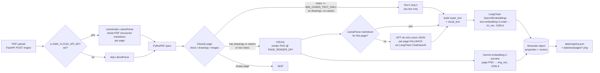
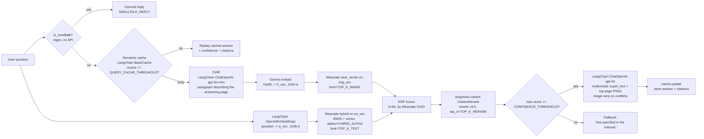
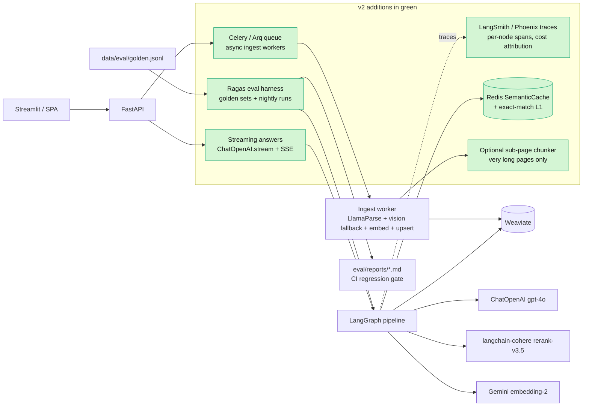

# Advanced RAG

Page-level RAG for technical PDFs (manuals, schematics, datasheets, tables). One **FastAPI** app, one **Streamlit** UI, a small **`src/advanced_rag`** package.

Each framework is used where it earns its keep:

- **LlamaIndex (`LlamaParse`)** — primary structured PDF extractor (per-page markdown, tables, figure captions). Falls back to GPT-4o-mini vision JSON when `LLAMA_CLOUD_API_KEY` is unset or LlamaParse errors.
- **LangChain** — everything model-facing: `ChatOpenAI` (HyDE + final multimodal answer + fallback vision JSON), `OpenAIEmbeddings` (text channel + semantic cache), `CohereRerank` (reranker), `langchain_core.caches.BaseCache` (semantic query cache).
- **LangGraph** — the query DAG (`hyde → retrieve → gate → answer | fallback`).
- **Direct client (kept small and focused)** — Gemini Embedding 2 for multimodal **image** embeddings (LangChain's Google wrapper is text-only), and the Weaviate v4 client (named-vector support in `langchain-weaviate` is limited).
- **Weaviate Cloud** — single collection, two named vectors (`txt_vec` + `img_vec`).

---

## Table of contents

1. [What we built (v1 summary)](#what-we-built-v1-summary)
2. [System design (current, v1)](#system-design-current-v1)
3. [Data model](#data-model-one-weaviate-object-per-kept-pdf-page)
4. [End-to-end data flow for one page](#end-to-end-data-flow-for-one-page)
5. [Query graph (LangGraph nodes, with I/O)](#query-graph-langgraph-nodes-with-io)
6. [Small-talk gate & semantic query cache](#small-talk-gate--semantic-query-cache)
7. [Evaluating accuracy (planned for v2)](#evaluating-accuracy-planned-for-v2)
8. [Next release (v2) design](#next-release-v2-design)
9. [How to scale](#how-to-scale)
10. [Why we chose this (with alternatives considered)](#why-we-chose-this-with-alternatives-considered)
11. [What would be ideal if cost & infra were no constraint](#what-would-be-ideal-if-cost--infra-were-no-constraint)
12. [Trade-offs (what you give up)](#trade-offs-what-you-give-up)
13. [Cost & latency budget](#cost--latency-budget)
14. [Setup / Docker / API](#setup)
15. [Notes](#notes)

---

## What we built (v1 summary)

Concise list of what is actually shipped today. Maps 1:1 to the file layout under `src/advanced_rag/` and to the Mermaid diagrams below.

**Ingestion pipeline**

1. FastAPI `POST /ingest` accepts a PDF (≤ `MAX_PDF_UPLOAD_MB`), persists it under `data/raw/pdfs/`, registers it in `data/registry.json`.
2. **LlamaIndex `LlamaParse` runs once per PDF** (if `LLAMA_CLOUD_API_KEY` is set), returning per-page markdown + tables + figure captions. Graceful fallback to the legacy flow if the key is missing or LlamaParse errors.
3. PyMuPDF walks every page and classifies it (free, metadata only) into **text-only / visual / skip**.
4. Visual pages are rendered to PNG at `PAGE_RENDER_DPI`. Visual pages **without** LlamaParse markdown fall back to `GPT-4o-mini` vision-JSON extraction via LangChain `ChatOpenAI`.
5. `super_text` is assembled from title + raw text + markdown + figure summaries; `visual_text` is kept for inspection.
6. Two named vectors are written on one Weaviate row per kept page:
   - **`txt_vec`** — LangChain `OpenAIEmbeddings` of `super_text` (`text-embedding-3-small`, 1536-d). Every kept page.
   - **`img_vec`** — direct Gemini `gemini-embedding-2-preview` of the rendered **PNG** (1536-d). Visual pages only.
7. Per-document pretty logs + counts (`pages_llamaparse`, `pages_vision_fallback`, `pages_visual`, `pages_skipped`).

**Query pipeline (LangGraph)**

1. **Small-talk gate** (regex, zero-cost) short-circuits greetings with `SMALLTALK_REPLY`.
2. **Semantic query cache** (`langchain_core.caches.BaseCache` subclass, OpenAI-embedded, JSON-on-disk, cosine threshold `QUERY_CACHE_THRESHOLD`) replays the full cached response (answer + citations + confidence) on near-duplicate questions.
3. **HyDE** — LangChain `ChatOpenAI` (`gpt-4o-mini`) generates one paragraph describing the *page that would answer this*.
4. **Dual-channel retrieval** from Weaviate:
   - Hybrid (BM25 + `txt_vec`) on OpenAI-embedded question — `alpha = HYBRID_ALPHA`.
   - `near_vector` on `img_vec` using Gemini-embedded HyDE paragraph (**same vector space as the indexed PNGs**).
5. **RRF fusion** (`k=60`) over the two ranked UUID lists.
6. **`langchain-cohere` `CohereRerank`** (`rerank-v3.5`) on the fused pool, `top_n = TOP_K_RERANK`.
7. **Confidence gate** (`CONFIDENCE_THRESHOLD`) routes either to the **answer** node (LangChain `ChatOpenAI` `gpt-4o`, multimodal: text contexts + up to `TOP_K_VISION_IN_ANSWER` page PNGs) or to a canned **fallback**.
8. **Citations filter** — `/query` only returns citations with `score ≥ CITATION_MIN_SCORE` (default `0.7`); the answer LLM still sees every reranked context, so answer quality is unaffected.
9. Non-fallback answers go back into the semantic cache.

**Ops & interfaces**

- **FastAPI** service: `/ingest`, `/documents`, `/documents/{id}` (DELETE + reindex), `/query`.
- **Streamlit UI**: library view + chat with inline page PNGs and cite panel.
- **Pretty logging** under `advanced_rag.*`; `LOG_LEVEL=DEBUG` for full excerpts.
- **Local registry** (`data/registry.json`) + **disk PDFs** + **disk PNGs** + **disk cache** — no database.

---

## System design (current, v1)

Two physical paths share one Weaviate collection: **ingestion** writes objects with up to two named vectors; **query** reads them and produces a grounded answer. The same `.env` and `get_settings()` feed both paths.

### Ingestion path



Notes:

- The classifier is **free** — it only inspects PyMuPDF metadata, never calls a model.
- **LlamaParse runs once per PDF** (whole-file call), not per page. Its per-page markdown feeds every kept page's `super_text`.
- **GPT-4o-mini vision JSON is only called as a fallback**: on a visual page where LlamaParse returned no markdown (or LlamaParse is disabled entirely).
- `txt_vec` is written for every kept page. `img_vec` is written **only** for visual pages (Gemini embeds the rendered PNG).
- One Weaviate `data.insert(...)` per page; the two vectors travel together as a `dict`.

### Query path



Notes:

- **Two embedding spaces**: `txt_vec` is OpenAI-1536; `img_vec` is Gemini-1536. They never need to be compared to each other — Weaviate keeps the two named vectors independent and we fuse only **after** ranking by their respective spaces.
- The cross-modal trick lives in the HyDE node: a *text* paragraph is embedded with the same Gemini model that embedded the page PNGs, so cosine similarity between text and image is meaningful.

### Runtime layout

```
.
├── api.py                 # FastAPI: /ingest, /documents, /reindex, /query
├── ui.py                  # Streamlit: library + chat
├── docker-compose.yml     # api + ui; Weaviate is cloud-only
├── Dockerfile
├── Makefile               # make api / make ui (loads .env)
├── pyproject.toml
├── .env.example
└── src/advanced_rag/
    ├── config.py          # pydantic-settings: all env-backed knobs
    ├── pretty_log.py      # stderr logging for logger name advanced_rag.*
    ├── openai_client.py     # LangChain ChatOpenAI + OpenAIEmbeddings shims
    ├── gemini_client.py     # direct google-genai (multimodal image embed)
    ├── llama_parse_client.py  # LlamaIndex LlamaParse: whole-PDF structured extraction
    ├── smalltalk.py         # is_smalltalk(text) regex gate
    ├── query_cache.py       # SemanticQueryCache(langchain_core BaseCache)
    ├── pipeline.py          # smalltalk → cache → LangGraph → cache.update
    ├── ingestion/           # pdf_ingest (LlamaParse primary, vision fallback), registry, reindex
    ├── indexing/            # vector_store (direct Weaviate v4), weaviate_delete
    └── retrieval/           # rerank (langchain-cohere CohereRerank)
```

---

## Data model (one Weaviate object per kept PDF page)

| Field / vector | Type | Role |
| --- | --- | --- |
| `source_doc_id` | `text` | Stable UUID for the PDF; used by `/documents/{id}` and Weaviate filter on delete/reindex. |
| `source_filename` | `text` | Original filename for citations. |
| `page_number` | `int` | 1-based PDF page index. |
| `page_image_path` | `text` | Path to `data/raw/pages/{doc_id}_p{n}.png` (visual pages only; `""` otherwise). |
| `is_visual` | `boolean` | `true` iff the classifier sent the page through vision JSON + Gemini image embed. |
| `title` | `text` | Page/section title from the vision JSON (often empty for text-only pages). |
| `super_text` | `text` | The BM25/`txt_vec` source. **Title + raw PyMuPDF text + structured markdown + figure summaries** concatenated. |
| `visual_text` | `text` | Stored only for inspection: visual summary + figure lines + labels from vision JSON. **Not embedded.** |
| `ingested_at` | `text` | ISO timestamp from `now_iso()`. |
| **`txt_vec`** | `vector` | OpenAI `text-embedding-3-small` of `super_text` (1536-d). Written for every kept page. |
| **`img_vec`** | `vector` | Gemini `gemini-embedding-2-preview` of the **page PNG** (`GEMINI_IMAGE_EMBEDDING_DIM`, default 1536). Visual pages only. |

The collection is created on first ingest with `Configure.Vectors.self_provided(...)` for both named vectors, plus `Configure.VectorIndex.hnsw(distance_metric=COSINE)` on each. `super_text` carries `inverted_index_config` enabled for BM25.

---

## End-to-end data flow for one page

A single PDF page through the ingest path, in code-execution order. (See `src/advanced_rag/ingestion/pdf_ingest.py`.)

1. **LlamaParse the whole PDF (once).** `llama_parse_client.parse_pages(pdf_path)` returns `list[{"page_number", "markdown", "title"}]` if `LLAMA_CLOUD_API_KEY` is set; otherwise `None` and we fall through to the vision fallback per visual page.
2. **Open and iterate.** `fitz.open(pdf_path)` → `for page_idx in range(len(doc))`. Each page is a `fitz.Page`.
3. **Classify (free).** `_classify_page(page)`:
   - Read text: `raw = page.get_text("text").strip()`.
   - Inspect rasters and vector drawings: `page.get_images(full=True)` and `page.get_drawings()`.
   - Decide: `text` / `visual` / `skip` (see `MIN_CHARS_TEXT_ONLY`).
4. **Pick structured content for the page.**
   - Prefer `lp_pages_by_num[page_number]["markdown"]` (from LlamaParse).
   - Else, for visual pages only, call `chat_vision_json(...)` (LangChain `ChatOpenAI` in JSON mode) on the rendered PNG. Text-only pages without LlamaParse content carry just `raw_text`.
5. **(Visual only) Render PNG.** `page.get_pixmap(dpi=PAGE_RENDER_DPI).save(...)` → `data/raw/pages/{doc_id}_p{n}.png`. Done regardless of LlamaParse because the PNG feeds the Gemini image embedder.
6. **Build texts.** `_build_texts(raw_text, structured)`:
   - `title` = LlamaParse title (first heading) or vision-JSON title.
   - `super_text` = title + raw text + LlamaParse markdown (or vision JSON markdown) + figure summary lines.
   - `visual_text` = visual summary + figure lines + labels (kept for inspection).
7. **Embed.**
   - Always: `txt_vec = embed([super_text])[0]` via `langchain_openai.OpenAIEmbeddings`.
   - Visual only: `img_vec = embed_image(Path(page_image_path))` via the direct Gemini client (the PNG bytes).
8. **Insert.** `collection.data.insert(properties={...}, vector={"txt_vec": ..., "img_vec": ...})`. Visual pages send both vectors; text-only pages send `txt_vec` only.
9. **Pretty-log.** Each step writes a structured `kv_lines(...)` block under the `advanced_rag.ingest` logger; LlamaParse and vision-fallback steps are wrapped in a `timed_step(...)` context.
10. **Registry update.** When the loop finishes, `pdf_ingest` returns counts (`pages`, `pages_visual`, `pages_llamaparse`, `pages_vision_fallback`, `pages_skipped`); `api.py` writes them to `data/registry.json`.

Reindex follows the same flow but first deletes all Weaviate objects with that `source_doc_id` and clears the doc’s PNGs from `data/raw/pages/`.

---

## Query graph (LangGraph nodes, with I/O)

State (`RagState`) carries: `question`, `hyde`, `contexts`, `answer`, `confidence`. Nodes are pure-ish functions in `src/advanced_rag/pipeline.py`.

| Node | Inputs | Calls | Outputs added to state |
| --- | --- | --- | --- |
| `hyde` | `question` | `chat(...)` → LangChain `ChatOpenAI(model=HYDE_MODEL, temperature=0.2)`; returns one short paragraph describing the *page* that would answer this question. | `hyde: str` |
| `retrieve` | `question`, `hyde` | 1) `embed([question])` via `langchain_openai.OpenAIEmbeddings` → `q_vec`. 2) `embed_text(hyde)` via the direct Gemini client → `h_vec`. 3) `col.query.hybrid(query=question, vector=q_vec, target_vector="txt_vec", alpha=HYBRID_ALPHA, limit=TOP_K_TEXT)`. 4) `col.query.near_vector(near_vector=h_vec, target_vector="img_vec", limit=TOP_K_IMAGE)`. 5) `_rrf_scores([text_ids, image_ids], k=60)` → fused UUID order. 6) `cohere_rerank(question, candidates, top_n=TOP_K_RERANK)` via `langchain_cohere.CohereRerank.compress_documents`. | `contexts: list[dict]` (reranked page records, each with `text`, `score`, `source_filename`, `page_number`, `page_image_path`, `is_visual`, `title`), `confidence: float` (max Cohere score) |
| `gate` (conditional edge) | `confidence` | Compares against `CONFIDENCE_THRESHOLD`. | Routes to `answer` or `fallback`. |
| `answer` | `question`, `contexts` | Build `text_block` from each context's `super_text` with `[source: <file>, p.<page>]` headers. Take up to `TOP_K_VISION_IN_ANSWER` existing PNGs from `page_image_path`. Call `chat_with_images(...)` → LangChain `ChatOpenAI(model=ANSWER_MODEL)` with an interleaved `HumanMessage` of text + `image_url` parts. | `answer: str` |
| `fallback` | — | (no API call) | `answer: "Not specified in the manual."` |

The graph is built in `build_graph()` — entry point `hyde`, then `hyde → retrieve`, conditional edges from `retrieve`, both terminal nodes go to `END`. `run(question)` wraps it with start/finish banners.

**Citations shown to the user** are filtered in `api.py` by `CITATION_MIN_SCORE` (default `0.7`): only reranked contexts whose Cohere `relevance_score >= CITATION_MIN_SCORE` are included in the `/query` response. The answer LLM still sees every reranked context (`top_k_rerank`) — this filter only controls what the UI shows next to the answer, so weakly-related "also-ran" pages don't get surfaced as if they were sources. If **no** context clears the bar, the response has `citations: []` and the UI shows the answer with no citation panel.

Helpers in the same file:

- `_rrf_scores(rankings, k=60)`: classic RRF: `score(uid) = sum(1 / (k + rank + 1))` over every list the UID appears in.
- `_to_record(obj)`: flatten a `weaviate.collections.classes.internal.Object` into a dict the answer node can format.
- `_summarize_hits(...)`: short per-hit log line including `score` (hybrid) or `distance` (near_vector) so the logs show **why** items came back.

---

## Small-talk gate & semantic query cache

`pipeline.run(question)` runs **two short-circuits** before it ever invokes the LangGraph. Both are configurable from `.env`.

### 1. Small-talk gate (`smalltalk.py`)

A tiny regex-only matcher (`is_smalltalk(text)`) catches greetings and pleasantries — `hi`, `hello`, `hey`, `how are you?`, `thanks`, `ok`, `cool`, `bye`, etc. — and returns `SMALLTALK_REPLY` immediately. **No LLM, no embedding, no vector, no rerank call.** Real questions (anything longer or containing real domain words) fall through to the cache + pipeline as normal.

Why a regex and not another LLM call: the obvious cases (10–20 short phrases) are the only ones we want to short-circuit, and a regex is free and deterministic. If you need broader intent classification later, swap the body of `is_smalltalk` for a `gpt-4o-mini` call.

### 2. Semantic query cache (`query_cache.py`)

A `langchain_core.caches.BaseCache` subclass (`SemanticQueryCache`) backed by:

- **OpenAI `text-embedding-3-small`** to embed each question (we already have this client; no extra vendor).
- An in-memory list of `(embedding, question, payload)` tuples, **persisted to a JSON file on disk** (`QUERY_CACHE_PATH`, default `data/query_cache.json`) so cache survives process restarts.
- **Cosine similarity** with a tunable threshold (`QUERY_CACHE_THRESHOLD`, default `0.95`).

On `lookup`:

- We embed the new question, score against every cached question, take the best.
- If `best >= QUERY_CACHE_THRESHOLD`, return the cached `Generation` whose `text` is the previous answer and whose `generation_info` carries `confidence`, `contexts`, `cache_hit=True`, `matched_question`, `similarity`.
- Pipeline unwraps that into a `RagState` so `/query` callers can't tell the difference (they see the original answer + citations).

On `update` (after a real pipeline run that produced a non-fallback answer):

- We embed the question, append a new entry, FIFO-trim if past `QUERY_CACHE_MAX_ENTRIES`, write the JSON file atomically.

Notable behavior:

- **Fallback answers are not cached.** "Not specified in the manual." would otherwise pollute later lookups.
- **Small-talk replies are not cached either** (they short-circuit before the cache lookup; no need).
- The cache is a **module-level singleton** built lazily on first use; clear with `SemanticQueryCache.clear()` or by deleting the JSON file.

### Why a LangChain `BaseCache` and not a homegrown class

Using `langchain_core.caches.BaseCache` is one tiny dependency (already pulled in transitively by `langgraph`) and gives us a **stable interface** so we can later swap to LangChain's built-ins:

- `RedisSemanticCache` (Redis + RediSearch) for cross-pod cache in production.
- `GPTCache` for a more featureful local store with eviction policies.
- `SQLiteVSSCache` for a SQLite-only deployment.

To swap, change the body of `get_cache()` in `query_cache.py` to instantiate the LangChain class and keep the same `LLM_STRING` namespace. The pipeline doesn't need to change.

### Tuning `QUERY_CACHE_THRESHOLD` (this matters)

`text-embedding-3-small` puts surprisingly different technical questions close together. Empirical scores on real-looking pairs:

| Cached question | New question | Cosine |
| --- | --- | --- |
| `What is the torque spec for M8 bolts?` | `What is the torque spec for M8 bolts?` (exact) | ~1.00 |
| ↑ | `M8 bolt torque spec?` | 0.91 |
| ↑ | `Tell me the torque value for an M8 bolt` | 0.88 |
| ↑ | `What is the torque spec for M10 bolts?` (different size!) | **0.93** |
| ↑ | `What is the torque spec for M8 nuts?` (bolts vs nuts!) | **0.95** |
| ↑ | `What is the torque sequence for M8 bolts?` (different question) | 0.85 |
| ↑ | `How do I bleed the brake fluid system?` (unrelated) | 0.70 |

Implications:

| Threshold | Behavior | Use when |
| --- | --- | --- |
| `0.97` | Near-exact only. Catches whitespace/case/punctuation reformulations. | Safety-critical technical docs where wrong specs cause real damage. |
| `0.95` (default) | Catches close paraphrases. **Risk: M8-bolts vs M8-nuts can collapse.** | Most technical-doc workloads; raise to 0.97 if your corpus is full of near-twin parts. |
| `0.90` | More aggressive; catches "Tell me X" rewordings of "What is X?". | FAQ-style apps where wording varies and stakes are low. |
| `<0.85` | Likely false positives. | Don't. |

Bottom line: **false positives return the wrong answer; false negatives just cost one extra LLM call.** Err high.

---

## Evaluating accuracy (planned for v2)

Today we **do not ship an evaluation harness** — answer quality is judged qualitatively by the Streamlit chat + the per-query logs. That's fine for a single-developer build, but it doesn't scale, and it can't catch regressions when we tune `HYBRID_ALPHA` / `TOP_K_*` / the prompt / the model.

v2 adds a **RAG evaluation harness** with three layers: **retrieval metrics**, **generation metrics**, and **end-to-end citation / UX metrics**. Our default tool will be **Ragas** (cleanest LangChain integration; it reuses our existing `ChatOpenAI` + `OpenAIEmbeddings`), with **LangSmith / Arize Phoenix** for traces.

### The metrics that matter for this system

| Layer | Metric (Ragas name) | What it measures | Why it matters here |
| --- | --- | --- | --- |
| **Retrieval** | `context_recall` | Did we pull back every page needed to answer the question? | If a spec spans 2 pages, missing one silently lowers answer quality. |
| Retrieval | `context_precision` | Of the pages we retrieved + reranked, how many are actually relevant? | Measures whether `CONFIDENCE_THRESHOLD` + `CITATION_MIN_SCORE` are tuned right. |
| Retrieval | `hit_rate@k`, `MRR@k` | Is the first relevant page in the top-k? At what rank? | Direct signal for `TOP_K_RERANK` and image-channel weighting. |
| **Generation** | `faithfulness` | Does every claim in the answer come from a retrieved context? | Catches hallucinations — the #1 risk with multimodal LLM answers. |
| Generation | `answer_relevancy` | Does the answer actually answer *this* question? | Catches off-topic / generic responses. |
| Generation | `answer_correctness` | Does the answer agree with the golden reference? | The single headline quality number. |
| **End-to-end** | citation precision | When the UI shows page X as a citation, was X actually the source? | Measures `CITATION_MIN_SCORE` calibration directly. |
| End-to-end | cache-hit quality | On cache hits, is the replayed answer still correct for the new question? | Audits `QUERY_CACHE_THRESHOLD`. The **scary** one — see the bolt-vs-nut row above. |
| End-to-end | latency p50 / p95, cost / query | Budget compliance. | Guards against regressions after prompt / model swaps. |

### How the harness will be wired (v2)

1. **Golden dataset** (`data/eval/golden.jsonl`) — 50–100 hand-curated `{question, reference_answer, reference_pages}` triples per corpus, collected from real user questions. Kept in git.
2. **Runner** (`eval/run_ragas.py`) — iterates the golden set, calls `pipeline.run(question)`, collects `(question, answer, contexts, reference_answer, reference_pages)` tuples, hands them to Ragas.
3. **Reporter** — Ragas metrics → CSV / markdown table + a single **aggregate quality score**. Committed per-run to `eval/reports/`.
4. **Regression gate** — a CI job compares new scores to the last green baseline; drops ≥ N points fail the PR.

Sketch:

```python
# eval/run_ragas.py
from ragas import evaluate
from ragas.metrics import (
    context_recall, context_precision,
    faithfulness, answer_relevancy, answer_correctness,
)
from datasets import Dataset

from advanced_rag.pipeline import run as rag_run

def build_row(item):
    state = rag_run(item["question"])
    return {
        "question": item["question"],
        "answer":   state.get("answer", ""),
        "contexts": [c["text"] for c in state.get("contexts", [])],
        "reference": item["reference_answer"],
        "reference_contexts": item["reference_pages"],
    }

ds = Dataset.from_list([build_row(x) for x in load_golden()])
report = evaluate(
    ds,
    metrics=[context_recall, context_precision,
             faithfulness, answer_relevancy, answer_correctness],
)
report.to_pandas().to_markdown("eval/reports/latest.md")
```

### Why Ragas (and not only Ragas)

| Tool | Where it fits in v2 | Why |
| --- | --- | --- |
| **Ragas** (primary) | Nightly / per-PR accuracy scoring | LangChain-native; canonical set of RAG metrics; no extra LLM client needed — it reuses `langchain_openai`. |
| **LangSmith** or **Phoenix** | Online trace review, spot-checking failures, cost attribution | Each LangGraph node + LangChain call becomes a span; easy drill-down into why a single bad answer happened. |
| **DeepEval** | Unit-style checks for the prompt contract | `GEval` with strict rubrics — catches prompt regressions before they ship (“answer must include torque units”). |
| **TruLens** | Optional, for feedback-function experiments | Nice for ad-hoc “did image X actually help?” ablations; not on the default path. |

### Sign-off criteria for a v2 release

- `answer_correctness ≥ 0.80` and `faithfulness ≥ 0.90` on the golden set for each corpus.
- `context_recall ≥ 0.90` (if we can't retrieve the right page, nothing downstream helps).
- `citation_precision ≥ 0.95` after filtering by `CITATION_MIN_SCORE`.
- p95 end-to-end latency ≤ 8 s on the warm path, ≤ 500 ms on cache hits.
- No regression of more than **2 points** on any metric vs. the previous baseline.

---

## Next release (v2) design

v2 keeps the v1 shape and adds everything that had to wait: eval, observability, streaming, multi-worker caching, background ingest, and a couple of retrieval improvements that need measurement first.



### What changes, and why

| Area | v1 (today) | v2 (planned) | Why |
| --- | --- | --- | --- |
| Evaluation | None | **Ragas harness + golden set + CI regression gate** | Catch regressions, tune `HYBRID_ALPHA` / thresholds with numbers instead of vibes. |
| Observability | Pretty logs to stderr | **LangSmith *or* Phoenix traces** per LangGraph run | Per-node cost + latency attribution; quick root-cause for bad answers. |
| Cache | JSON-on-disk, single process | **Redis SemanticCache** (LangChain `RedisSemanticCache`) + a tiny exact-match L1 | Safe across multiple API replicas; proper TTLs + eviction. |
| Ingest | Synchronous inside the request | **Queue (Arq / Celery) + workers** | PDFs stop blocking the API; retry + concurrency control; rate-limit safety for LlamaParse. |
| Answer delivery | Buffered JSON | **Server-sent streaming** from `ChatOpenAI.stream()` | UX: first tokens in ~500 ms instead of ~3–5 s. |
| Chunking | Page grain only | **Optional sub-page chunker for very long pages** (≥ ~6 k tokens) | Keeps `super_text` under embedding context and avoids diluting vectors. |
| Auth | None | **API key + per-doc ACL in the registry** | First step toward multi-tenant. |
| Registry | `registry.json` | **Postgres** (SQLAlchemy) if/when we need multi-worker | JSON file isn't safe across concurrent writers. |
| Storage | Local disk | **S3 / GCS** for PDFs and page PNGs | Required for horizontal API scale. |
| Retrieval tuning | Fixed `HYBRID_ALPHA` | **Per-corpus tuning driven by Ragas sweep** | Different manuals reward different alphas. |
| Reranker | Cohere `rerank-v3.5` | Same, **but evaluated against `bge-reranker-v2-m3`** self-hosted | See if self-hosted beats the paid API on our corpus. |

### What v2 deliberately does *not* change

- The **dual named-vector** schema (still `txt_vec` + `img_vec`). It works; Ragas will prove or disprove that before we touch it.
- **Direct Gemini for image embeddings**, **direct Weaviate v4 for named vectors** — LangChain wrappers still don't fit these two.
- The **LangGraph shape** (`hyde → retrieve → gate → answer | fallback`). Streaming + caching layer onto it without changing nodes.

---

## How to scale

The v1 design is intentionally boring to scale because state is pushed outward: **Weaviate Cloud** holds the corpus, **OpenAI / Cohere / Gemini / LlamaCloud** hold the models, and the local process owns only a JSON registry + a JSON cache. Here's the per-component story:

| Component | v1 today | What breaks first at scale | How to scale it |
| --- | --- | --- | --- |
| **FastAPI (`api.py`)** | Single uvicorn worker | Local JSON writes (registry, cache) become unsafe with >1 worker. | Move registry to Postgres; move cache to Redis (v2). Then run N uvicorn workers behind any load balancer. API is otherwise stateless. |
| **Streamlit UI (`ui.py`)** | Single process, server-rendered | Streamlit holds session state per websocket; a single process serves all users. | For a handful of internal users: keep Streamlit and run one container per N users. For public / many users: rebuild the UI as a React SPA against `api.py` directly. |
| **Ingest** | Runs inline on `POST /ingest` | LlamaParse rate limits + large PDFs block the API; a 200-page PDF can take minutes. | v2 queue + workers (Arq / Celery). Scale workers independently of the API. Size the worker pool to `LlamaCloud RPS / pages_per_pdf`. |
| **Weaviate Cloud** | Single named collection on a single cluster tier | Latency on hybrid/near-vector over millions of rows. | Upgrade the cluster tier (Weaviate Cloud) or self-host a multi-node cluster sharded by `source_doc_id`. Named-vector schema is already compatible. |
| **OpenAI (chat + embed)** | Serial calls per request | TPM / RPM rate limits at high QPS. | Batched embedding; org-level rate-limit lifting; for embeddings, switch to **Azure OpenAI** with per-region quota; consider `gpt-4o-mini` for long-tail queries and reserve `gpt-4o` for high-confidence answers. |
| **Cohere rerank** | Serial per query | RPS limits; cost per 1k searches. | Request batching; lower `TOP_K_TEXT + TOP_K_IMAGE` if the Ragas curve shows diminishing returns past ~20 candidates. |
| **Gemini image embed** | One call per page on ingest, one per query | Preview-tier rate limits. | Parallelize per-page embeds with `asyncio.gather`; cache per-PDF hashes on disk so reindex is free. |
| **Semantic cache** | JSON on local disk | Two processes writing — last writer wins. | v2: Redis `SemanticCache` (`langchain-redis`). Same `BaseCache` interface, zero pipeline change. Add a **cheap exact-match L1** in front. |
| **Registry** | `data/registry.json` | Race conditions with multiple API workers or concurrent uploads. | v2: swap for Postgres (one table, same shape). Or DynamoDB if we're on AWS. |
| **PDF / PNG storage** | Local disk (`data/raw/`) | Doesn't survive pod restarts; can't share across API replicas. | Mount a shared volume for a single host; **S3 / GCS** for multi-host. PNG URLs in Weaviate rows become signed-URL keys. |
| **Query cost** | Dominated by `gpt-4o` multimodal answer | Budget blow-up at high QPS. | Aggressive semantic cache (v2 Redis), lower `TOP_K_VISION_IN_ANSWER`, route short / fact-lookup queries to `gpt-4o-mini`, use streaming so users perceive speed. |
| **Ingest cost** | Dominated by LlamaParse (with key) or per-page vision (without) | LlamaCloud free tier cap; GPT-4o-mini vision tokens. | For large corpora, disable LlamaParse Premium; keep the PyMuPDF classifier strict (high `MIN_CHARS_TEXT_ONLY`) to keep vision-fallback pages minimal. |

Rough capacity sketch (default v1 with 2 uvicorn workers):

- **Read path**: ~5–15 RPS per worker, bounded by `gpt-4o` latency. With semantic cache hit rate 40% you can plausibly serve ~30 RPS per worker.
- **Ingest**: ~1–2 PDFs in parallel per host before hitting LlamaParse rate limits; queue + workers (v2) remove this ceiling.
- **Storage**: page PNGs at 300 DPI are 200–800 KB each; a typical 100-page manual is ~20–50 MB of PNGs plus the PDF.

---

## Why we chose this (with alternatives considered)

**Framework roles (who owns what):**

| Concern | Framework | Why |
| --- | --- | --- |
| **PDF structured extraction** | **LlamaIndex `LlamaParse`** | LlamaIndex's one killer feature for technical PDFs. Real layout/table/figure-caption extraction without us orchestrating per-page vision calls. Degrades gracefully when no key is set. |
| **LLM chat (HyDE + final answer + fallback vision JSON)** | **LangChain `ChatOpenAI`** | First-class multimodal messages; clean structured-output binding for JSON mode. |
| **Text embeddings (txt_vec + semantic cache)** | **LangChain `OpenAIEmbeddings`** | Symmetric with `ChatOpenAI`; trivial to swap to `AzureOpenAIEmbeddings` if needed. |
| **Reranker** | **`langchain-cohere` `CohereRerank`** | Same Cohere API, but wraps results as `Document` with `relevance_score` in metadata — easier to compose with LangChain retrievers later. |
| **Query DAG** | **LangGraph** | `hyde → retrieve → gate → answer \| fallback` with conditional edges; the gate + fallback reads better as a graph than as nested `if`s. |
| **Semantic query cache** | **`langchain_core.caches.BaseCache`** | Swappable for `RedisSemanticCache` / `GPTCache` / `SQLiteVSSCache` later with zero pipeline changes. |
| **Multimodal image embeddings (img_vec + query-side HyDE embedding)** | **Direct `google-genai`** | LangChain's `GoogleGenerativeAIEmbeddings` is text-only; we need `types.Part.from_bytes(image/png)`. |
| **Vector store (two named vectors)** | **Direct `weaviate-client` v4** | `langchain-weaviate` doesn't cleanly support Weaviate v4 named vectors + hybrid + near_vector with different dims. |

**Model / design decisions:**

| Decision | Why we picked it | Alternatives we considered, and why we didn't |
| --- | --- | --- |
| **LlamaParse primary with GPT-4o-mini-vision fallback** | LlamaParse produces clean per-page markdown + tables + figure captions without us writing extraction prompts. One whole-PDF call replaces N per-page vision calls, which is both cheaper and faster on mostly-text PDFs. If the key is missing or LlamaParse errors, the legacy path still works — no hard dependency on a paid service. | (a) **GPT-4o-mini vision JSON everywhere** (our previous version) — worked, but per-page vision calls dominate ingest cost. (b) **LlamaIndex local `PyMuPDFReader`** — just wraps PyMuPDF, adds no real value. (c) **Unstructured.io** — richer layout model but heavier deps. |
| **OpenAI for chat + text embeddings + fallback page vision** | Single dominant vendor for generation; cheap text embeddings (`text-embedding-3-small`, 1536-d); strong vision JSON mode (used only in the LlamaParse-absent fallback). | Anthropic Claude (no embedding model in-house); Gemini Pro for everything (JSON mode still moving). |
| **Gemini Embedding 2 (`gemini-embedding-2-preview`) for `img_vec`** | First public model that embeds **text and images into the same space** with one SDK. We embed the rendered PNG directly, so layout/diagrams/tables that resist verbalization still produce useful vectors. The same model embeds the HyDE paragraph at query time. | (a) **Text describing the page** — fast and one-vendor, but loses real visual signal. (b) **OpenAI CLIP-like embeddings** — not a first-party OpenAI product right now. (c) **ColPali / ColBERT-on-images** — great quality, requires self-hosting a GPU model and a multi-vector retriever; too heavy. (d) **Vertex multimodal embedding** — viable, but `gemini-embedding-2-preview` covers more modalities under one API. |
| **Two named vectors on one collection** | Weaviate named vectors are independent (own dim, own HNSW), so we can mix providers and still write **one row per page**. Hybrid on `txt_vec` keeps BM25 working; `img_vec` adds a layout/visual channel. | Two separate collections + a join — doubles ingest writes and complicates reranking. Single vector with all-text content — loses the visual channel entirely. |
| **`gpt-4o-mini` for per-page extraction and HyDE** | An order of magnitude cheaper than `gpt-4o`, plenty good for "describe this page as JSON" and "describe what the answering page would look like." | `gpt-4o` for everything — quality bump per page is marginal but cost goes up ~10×. Open-source vision (Qwen2-VL etc.) — you'd need to host it. |
| **`gpt-4o` only for the final answer** | The final step is multimodal (text + page PNGs) and benefits the most from the larger model's grounding. | `gpt-4o-mini` for answer too — measurably worse on multi-source synthesis. |
| **Page grain (one Weaviate row per kept page)** | Matches how engineers think (“see page 47”) and what we cite back. Avoids hierarchical chunk graphs and parent/child stitching. | Section/heading chunks — needs a layout model and breaks for diagram-heavy pages. Token windows — citations get messy. |
| **PyMuPDF classifier before any paid call** | Two-thirds of typical manual pages are pure text, where vision would just burn money. The classifier is free and uses information already present in the PDF. | Always run vision — simpler code, much higher cost. |
| **HyDE on the image side only** | The user's *question* already works well for BM25 + text-vector hybrid; what BM25 misses are diagrams whose vocabulary differs from the question. A "what does the answering page look like?" paragraph helps **only** the image channel. | HyDE on the text channel — small gain, doubles `gpt-4o-mini` calls per query. No HyDE — recall on visual pages drops. |
| **RRF instead of a learned fusion model** | Deterministic, easy to log, no training data needed. | Linear weights — needs labels per corpus. Learned fusion (e.g. monoT5 over both lists) — adds another model and another latency hop; rerank already does most of this work. |
| **Cohere `rerank-v3.5`** | Strong cross-encoder-style reordering on the fused pool, sub-second, no GPU to host. | bge-reranker-large / mxbai-rerank — comparable quality but you have to host them. |
| **LangGraph for the query DAG; LangChain for LLM/embeddings/rerank; direct clients only where wrappers fall short** | Each framework does what it's best at. LangChain gives us consistent messages/embeddings/rerank abstractions and an ecosystem to grow into (retrievers, runnables). LangGraph expresses the conditional gate cleanly. Direct clients stay *only* where LangChain wrappers are missing (multimodal Gemini image embed) or lossy (Weaviate v4 named vectors). | (a) **Full LangChain migration**, including `langchain-weaviate` and `GoogleGenerativeAIEmbeddings` — loses named-vector hybrid + multimodal image embedding. (b) **No LangChain at all** — more bespoke code; harder to swap providers later. |
| **`langchain_core.caches.BaseCache` for the semantic cache** | Stable interface; easy to swap for `RedisSemanticCache` / `GPTCache` / `SQLiteVSSCache` in production. `langchain-core` is already a transitive of LangGraph (~free dep). | (a) **Homegrown cache class** — fewer abstractions, but no migration path to a real cache backend. (b) **`InMemoryCache` (exact match)** — too strict, doesn't catch paraphrases. (c) **`RedisSemanticCache` from day one** — adds a service to the stack we don't yet need. |
| **Regex small-talk gate** | Free, deterministic, one file. Catches the obvious 10–20 phrases that account for nearly all chitchat. | (a) **`gpt-4o-mini` intent classifier** — cleanest, but adds a per-query LLM call. (b) **Skip the gate entirely** — the answer node would say "Not specified in the manual." for "hi", which is a bad UX. |
| **Local `registry.json` + disk PDFs** | Trivial UX for list/delete/reindex. No DB to run. | Postgres/SQLite catalog — overkill for a single-tenant tool. |
| **No `/health` endpoint** | The UI reads upload limits from the same `get_settings()` as the API (shared `.env`), so an HTTP probe was redundant. | Keep `/health` — fine but adds a moving part for what the UI already has. |

---

## What would be ideal if cost & infra were no constraint

Everything above is a pragmatic build for a small team and a modest budget. If we were sizing this for an enterprise deployment with an SLA and no budget pressure, here's what each piece would ideally become — and what it actually buys you vs. what we ship today.

| Area | v1 today | Ideal at "no constraints" | What you actually gain |
| --- | --- | --- | --- |
| **PDF extraction** | LlamaParse standard (+ GPT-4o-mini vision fallback) | **LlamaParse Premium** for layout-rich docs **plus** **Google Document AI** / **Azure Document Intelligence** for forms / legal / invoices. Pick per doc type at upload. | Better tables, better KV pairs on forms, better equations; fewer vision-fallback cases. |
| **Image-side retrieval** | Gemini Embedding 2 on rendered page PNG | **ColPali** (ViT patch-level multimodal retrieval), self-hosted on GPU | SOTA on diagrams / schematics / dense figures; measurably higher hit@k on visual pages. Cost: you host it. |
| **Text-side retrieval** | OpenAI `text-embedding-3-small` + BM25 hybrid | `text-embedding-3-large` + **a domain-adapted fine-tune** on your corpus | Better recall on jargon-heavy manuals. Fine-tune pays off once the corpus is stable. |
| **Chunking** | Page grain only | **Hybrid: page + semantic sub-chunk + GraphRAG-style entity chunks** | Long pages stop diluting vectors; cross-page entity relations become queryable. |
| **Reranker** | Cohere `rerank-v3.5` | **Cohere `rerank-v3.5` + a local cross-encoder (`bge-reranker-v2-m3`)**, pick the better score per query. | Near-SOTA today; redundant second opinion for safety-critical answers. |
| **Generator** | `gpt-4o` multimodal | **Frontier model per query tier**: reasoning-heavy → `o-series`; multimodal synthesis → `gpt-5` / `claude-4.5-opus`; short facts → `gpt-4o-mini`. Streamed. | Better answers on hard questions; lower cost on easy ones. Requires a router. |
| **Orchestration** | LangGraph + LangChain wrappers | **Same, + LangGraph Cloud or a managed deployment** | Checkpointing, human-in-the-loop for low-confidence answers, graph versioning. |
| **Vector DB** | Weaviate Cloud | **Self-hosted Weaviate cluster** with per-tenant shards **or** **Milvus** for very large scale | Full control, no per-object pricing, better multi-tenant isolation. |
| **Cache** | JSON on disk | **Two-tier: Redis exact-match L1 → Redis SemanticCache L2**, warmed from query logs | Cache hit rate goes from ~10–20% to ~40–60% on real traffic. |
| **Eval & monitoring** | None in v1 | **Ragas nightly + LangSmith online + a human-label queue** wired to low-confidence answers | Continuous quality tracking; you catch model-drift and prompt regressions in days, not months. |
| **Storage** | Local disk | **S3 / GCS** with lifecycle rules; per-tenant KMS | Multi-region, durable, cheap cold storage for old PDFs. |
| **Security** | None beyond env vars | **Per-doc ACLs**, **audit log**, **prompt-injection defense** at the answer prompt, **PII redaction** at ingest | Required for any real customer deployment. |
| **UI** | Streamlit chat | **React SPA + streaming tokens + page image overlay + click-to-jump-to-source** | 10× better UX; suitable for external users. |

None of these are cheap, and **several are not free gains** — e.g., ColPali raises accuracy on diagrams but requires GPU hosting and a custom multi-vector retriever; a GPT-5-class model raises answer quality but raises per-query cost. The v1 design is deliberately a few tiers below this so a solo operator can run it end-to-end on cloud-managed services.

---

## Trade-offs (what you give up)

| Choice | Benefit | Cost / risk | Mitigation |
| --- | --- | --- | --- |
| **LlamaParse as primary extractor** | One whole-PDF call replaces up-to-N per-page vision calls; handles tables / layout / figures natively; cleaner per-page markdown feeding `super_text`. | **Paid, hosted, network-dependent.** Requires `LLAMA_CLOUD_API_KEY`. Free tier pages/month limit. Rate limits can slow bulk ingest. Preview mode is more expensive. | Optional: `parse_pages(...)` returns `None` on missing key or exception, and the per-page `chat_vision_json` fallback kicks in transparently. Logs show `pages_llamaparse` vs `pages_vision_fallback` so you can see what was served by which. |
| **LangChain wrappers for chat / embed / rerank** | Easier to swap providers (Azure OpenAI, Anthropic-embedding-via-LC, etc.) and to add LCEL chains later. | More indirection; extra `langchain-openai` / `langchain-cohere` deps; occasional breaking-change churn in the LangChain ecosystem. | Wrappers are behind our own `openai_client.py` / `retrieval/rerank.py` shims — one file to change if a LC version breaks. |
| **`img_vec` is true multimodal embedding (Gemini)** | Vectorizes the rendered page itself — layout / diagrams / tables get real signal. | Adds a second vendor (and a second API key) and a preview-tier model. | Wrapped behind `gemini_client.py`; swap one file to change provider. Bump `WEAVIATE_COLLECTION` if dim changes. |
| **Two embedding providers across `txt_vec` / `img_vec`** | Best tool per channel (cheap OpenAI text vs. native multimodal). | Two SDKs, two billings, an extra small Gemini embed call per question. | Cost is dominated by the LLM answer; embed cost is tiny (see budget below). |
| **Preview model (`gemini-embedding-2-preview`)** | Newest unified multimodal space; MRL lets you pick 768 / 1536 / 3072 dims for cost vs. quality. | Pricing and API may change before GA; vector space is **incompatible** with `gemini-embedding-001`. | Pinned via env (`GEMINI_IMAGE_EMBEDDING_MODEL` / `_DIM`); collection name is bumpable. |
| **Page grain (one row per page)** | Stable citations, simple ingest. | Long pages can blow past `super_text` size budgets; very tiny pages may starve BM25. | Classifier already drops blank pages. For very long pages, lower `PAGE_RENDER_DPI` and let vision summarize; or add a chunk pass later. |
| **HyDE only on image side** | Cheap recall boost where it matters. | If `gpt-4o-mini` writes a misleading paragraph, the image channel can pull garbage candidates. | RRF dampens it, Cohere rerank filters it; gate falls back if max score is too low. |
| **RRF with fixed `k=60`** | No hyperparameter to tune in code. | Not optimal for every corpus. | `HYBRID_ALPHA` + `TOP_K_*` are env-tunable; `k` is one constant in `_rrf_scores`. |
| **Single global confidence gate** | One knob (`CONFIDENCE_THRESHOLD`). | Default `0.05` is permissive — Cohere scores rarely trigger fallback; you can get a confident-sounding answer on weak evidence. | Raise the threshold (e.g. 0.20) for stricter "I don't know" behavior; logs print the score per query. |
| **Weaviate schema created in code on first ingest** | One-shot setup; `vector_config` and HNSW pinned in code. | Changing `GEMINI_IMAGE_EMBEDDING_DIM` (or either embedding model) requires a fresh schema. | Bump `WEAVIATE_COLLECTION` (e.g. `DocPages` → `DocPages2`) **or** use `weaviate_delete` to drop the old one, then re-ingest. |
| **Local `registry.json` + disk PDFs** | Simple list/delete/reindex UX. | No multi-user auth; backups are your responsibility. | Mount `data/` to a volume in Docker; treat the registry as source-of-truth and re-ingest from PDFs. |
| **Vision JSON extraction** | Structured fields for titles/figures; great for `super_text` quality. | Model can hallucinate or miss small print. | Answer step re-attaches **the original PNGs** and the prompt says image wins on conflicts. |
| **Image cap in answer (`TOP_K_VISION_IN_ANSWER=2`)** | Bounds GPT-4o vision-token cost per query. | If the right page is rank 3, the model only sees its `super_text`, not its image. | Increase the cap if your manuals are diagram-heavy and you can spend more per question. |
| **Semantic cache with cosine threshold** | Repeat / near-duplicate questions cost ~1 OpenAI embed instead of full pipeline (~10–100×× cheaper, ~10× faster). | Threshold tuning is a real risk: too low → wrong answers from the cache; too high → cache rarely hits. `text-embedding-3-small` makes "M8 bolts" vs "M8 nuts" worryingly close (~0.95). | Default 0.95 is a balance; **raise to 0.97 for safety-critical docs**. Cache stores the full citation set so users can still verify the cached answer. Fallback answers are not cached. |
| **JSON-on-disk cache, single-process** | Zero infra, survives restarts, easy to inspect or wipe (`rm data/query_cache.json`). | Not safe across multiple processes (last writer wins on the JSON file). No TTL. No eviction beyond FIFO past `QUERY_CACHE_MAX_ENTRIES`. | Swap `get_cache()` for `RedisSemanticCache` (or any other LangChain `BaseCache`) when you scale to >1 worker. |
| **Regex small-talk gate** | Zero-cost, deterministic. | Won't catch creative chitchat ("yo what's poppin"). False negatives just cost a real pipeline call (cheap). False positives can short-circuit a real one-word question (rare). | Conservative regex, anchored to short inputs (≤60 chars). Edit `_GREETING_RE` in `smalltalk.py` to extend. |

---

## Cost & latency budget

Approximate, **per call**, at the time of writing. Always check the live pricing pages for your provider before sizing a real workload.

| Step | Service / model | Approx. unit cost | Approx. latency | Notes |
| --- | --- | --- | --- | --- |
| **Small-talk hit (per query)** | none | $0 | <1 ms | Pure regex; `is_smalltalk` returns `True`, pipeline returns `SMALLTALK_REPLY`. |
| **Semantic cache hit (per query)** | OpenAI `text-embedding-3-small` via `langchain-openai` (one call) | ~$0.00002 / hit | ~50–150 ms total | Skips HyDE / Weaviate / Cohere / GPT-4o entirely. ≈ **100× cheaper, ~30× faster** than the warm pipeline path. |
| **Whole-PDF structured extraction (primary)** | **LlamaIndex `LlamaParse`** | per-page pricing — see [LlamaCloud pricing](https://cloud.llamaindex.ai) (free tier + paid plans). "Premium" mode costs more than standard. | ~5–30 s / whole PDF (hosted service; scales with page count + complexity) | One call per PDF, not per page. Replaces most of the legacy per-page vision JSON cost when enabled. |
| Per-page text embed | OpenAI `text-embedding-3-small` via `langchain-openai` | ~$0.02 / 1M tokens | ~50–150 ms / batch | One `super_text` per kept page; embedding cost is the smallest line item by far. |
| Per-page vision JSON (**fallback only**) | OpenAI `gpt-4o-mini` via `langchain-openai` (vision in, JSON out) | input ~$0.15 / 1M, output ~$0.60 / 1M, **plus** image input tokens | ~1–3 s / page | Runs only on visual pages where LlamaParse returned no markdown (or LlamaParse is disabled). |
| Per-page image embed | Gemini `gemini-embedding-2-preview` (direct SDK) | preview pricing — see [Google AI Studio](https://aistudio.google.com/) / [Vertex AI](https://cloud.google.com/vertex-ai/generative-ai/docs/models/gemini/embedding-2) | ~200–500 ms / page | **Visual pages only.** Cost is tiny vs. vision JSON. |
| HyDE (per query) | OpenAI `gpt-4o-mini` via `langchain-openai` (text only) | input ~$0.15 / 1M, output ~$0.60 / 1M; ~few hundred output tokens | ~300–800 ms | One short paragraph; cheap. |
| Question text embed (per query) | OpenAI `text-embedding-3-small` via `langchain-openai` | ~$0.02 / 1M tokens | ~50–150 ms | Single string. |
| HyDE image-space embed (per query) | Gemini `gemini-embedding-2-preview` (direct SDK) | preview pricing | ~200–500 ms | Single string. |
| Weaviate hybrid + near_vector | Weaviate Cloud (direct v4 client) | included in plan | ~50–200 ms each, can run in sequence | We do them sequentially in code; Weaviate itself is fast. |
| Cohere `rerank-v3.5` (per query) | `langchain-cohere` `CohereRerank` | ~$2 per 1k searches (typical) | ~200–500 ms | Reorders the fused pool of up to ~`TOP_K_TEXT + TOP_K_IMAGE` items. |
| Final answer (per query) | OpenAI `gpt-4o` via `langchain-openai` (multimodal in, text out) | input ~$2.50 / 1M, output ~$10 / 1M, **plus** image input tokens for the attached PNGs | ~2–6 s | Dominant cost per query. Bound by `TOP_K_VISION_IN_ANSWER` (default 2). |

Rough rules of thumb:

- **Ingestion cost is dominated by the structured extractor.** With **LlamaParse enabled**: one whole-PDF call + one tiny text embed per kept page + one Gemini image embed per visual page. Expect **a few cents per manual** under LlamaCloud's standard tier; more with premium. With **LlamaParse disabled (fallback)**: one `gpt-4o-mini` vision call *per visual page* — dominates cost.
- **Query cost is dominated by `gpt-4o` answer with images.** Each answer with 2 page PNGs is the most expensive step; keep `TOP_K_VISION_IN_ANSWER` low and only raise `TOP_K_RERANK` (text-only context) if you need more breadth.
- **End-to-end query latency is roughly: HyDE (~0.5s) + 2 embeds (~0.5s) + 2 Weaviate hits (~0.3s) + Cohere (~0.3s) + GPT-4o multimodal (~3s) ≈ 4–6 s on a warm path.** A semantic-cache hit collapses that to ~100 ms, and a small-talk hit to <1 ms.
- **Schema-recreation note:** changing `GEMINI_IMAGE_EMBEDDING_DIM` from 1536 to 3072 will not save money or latency in a meaningful way for this workload, but it will require re-ingestion. Default 1536 is the recommended balance.

---

## What it does (end user)

1. Upload a PDF in the UI.
2. The whole PDF goes through **LlamaIndex `LlamaParse`** (if `LLAMA_CLOUD_API_KEY` is set) for structured per-page markdown. Each page is then classified (**text-only**, **visual**, or **skip**). Visual pages get a PNG + a **Gemini** multimodal embedding; visual pages *without* LlamaParse markdown fall back to **GPT-4o-mini** vision JSON. All kept pages get a LangChain `OpenAIEmbeddings` vector for `txt_vec`. Everything is written as one Weaviate object with up to two named vectors.
3. Ask a question: small-talk gate → semantic cache → HyDE (LangChain `ChatOpenAI`) → hybrid on `txt_vec` ‖ near_vector on `img_vec` → RRF → `langchain-cohere` `CohereRerank` → `gpt-4o` multimodal answer with optional page images.

---

## Setup

```bash
uv sync
cp .env.example .env        # OPENAI_API_KEY, GEMINI_API_KEY, COHERE_API_KEY,
                            # WEAVIATE_URL, WEAVIATE_API_KEY,
                            # LLAMA_CLOUD_API_KEY (optional — enables LlamaParse)
make api                    # uv run --env-file .env uvicorn api:app --reload --port 8000
make ui                     # uv run --env-file .env streamlit run ui.py
```

The Weaviate collection (named vectors **`txt_vec`** / **`img_vec`**) is created on first ingest if it does not exist. If you change **`GEMINI_IMAGE_EMBEDDING_DIM`** or either embedding model later, bump **`WEAVIATE_COLLECTION`** (or delete the existing collection) so the new vectors land in a fresh schema with matching dims.

**Logging:** set **`LOG_LEVEL=DEBUG`** in `.env` for full HyDE text and longer excerpts. Default **`INFO`** uses boxed banners and timings under the `advanced_rag` logger.

---

## Docker

```bash
docker compose up --build -d
# UI:  http://localhost:8501
# API: http://localhost:8000/docs
```

---

## API

| Method | Path | What |
| --- | --- | --- |
| `POST` | `/ingest` | Upload one PDF (≤ `MAX_PDF_UPLOAD_MB`, default 200). |
| `GET` | `/documents` | List cataloged PDFs. |
| `DELETE` | `/documents/{doc_id}` | Remove registry entry, disk files, Weaviate rows for that `doc_id`. |
| `POST` | `/documents/{doc_id}/reindex` | Re-run ingestion from the saved PDF. |
| `POST` | `/query` | Run the LangGraph; returns answer, confidence, citations. |

---

## Notes

- **`data/raw/pdfs/`** — stored PDFs. **`data/raw/pages/`** — PNGs for visual pages only. **`data/registry.json`** — local catalog for the UI (not a substitute for a database). **`data/query_cache.json`** — semantic cache; safe to delete.
- **Key env vars** (see `.env.example`):
  - models: `ANSWER_MODEL`, `EXTRACT_MODEL`, `HYDE_MODEL`, `EMBEDDING_MODEL`, `GEMINI_IMAGE_EMBEDDING_MODEL`, `GEMINI_IMAGE_EMBEDDING_DIM`
  - extractor: `LLAMA_CLOUD_API_KEY`, `LLAMA_PARSE_RESULT_TYPE`, `LLAMA_PARSE_PREMIUM`
  - retrieval: `TOP_K_TEXT`, `TOP_K_IMAGE`, `TOP_K_RERANK`, `HYBRID_ALPHA`, `CONFIDENCE_THRESHOLD`, `CITATION_MIN_SCORE`
  - classifier: `MIN_CHARS_TEXT_ONLY`, `MIN_CHARS_KEEP_PAGE`, `PAGE_RENDER_DPI`
  - small-talk + cache: `ENABLE_SMALLTALK`, `SMALLTALK_REPLY`, `ENABLE_QUERY_CACHE`, `QUERY_CACHE_THRESHOLD`, `QUERY_CACHE_PATH`, `QUERY_CACHE_MAX_ENTRIES`
